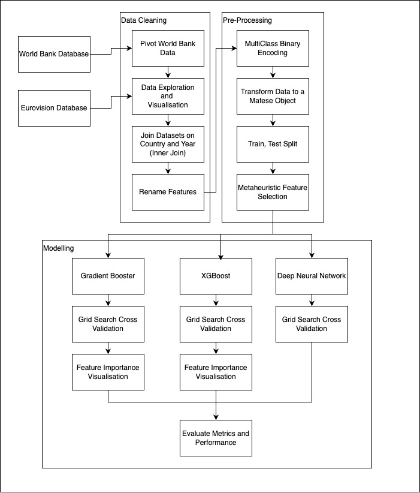

# Eurovision Song Contest Data Exploration

## Setup

```sh
pip install -r requirements.txt
```

if you are using mac:
```sh
brew install libomp
```

## Running the model

Navigate to the [using hot encoding file](./aggregated_language_data/using_hot_encoding_instead_of_exploding.ipynb) and run the script. This will take around an hour to run.

The most recent run of this model produced the following results:

```sh
Run at: 2024-12-11 08:59:04.986868
Weights = [0.9, 0.1]
Outputs:
	RMSE_train: 5.5669594673524445
	MAE_train: 4.19307670936099
	MAPE_train: 1.0
	R2_train: 0.1920503603549869
	NSE_train: 0.1920503603549869
	KGE_train: 0.11701805790130126
	RMSE_test: 5.8818344885807265
	MAE_test: 4.627545016018758
	MAPE_test: 1.0
	R2_test: 0.08004271035402333
	NSE_test: 0.08004271035402333
	KGE_test: -0.016991711209708882
Gradient Boosting
	Test RMSE: 5.942978864276755
	Test MAE: 4.798021973192663
	Test R²: 0.060816536043834635
	Best parameters: 
	learning_rate: 0.01
	max_depth: 3
	min_samples_leaf: 2
	min_samples_split: 10
	n_estimators: 300
XGBoost
	Test RMSE: 5.952397318517807
	Test MAE: 4.831225314038865
	Test R²: 0.05783730745315552
	Best parameters: 
	colsample_bytree: 0.3
	learning_rate: 0.01
	max_depth: 4
	n_estimators: 300
Deep Neural Network
	Test RMSE: 20.514174123089397
	Test MAE: 6.457554963463587
	Test R²: -10.190516471862793
```

## Structure of the Repository

The process of building the model follows this diagram:



### [Aggregated Language Data](./aggregated_language_data/)

This contains the _main_ scripts used to produce the machine learning model.

**NOTE**: This directory contains a file, [outputs.txt](./aggregated_language_data/outputs/outputs.txt) that contain the latest runs and testing metrics for the models

### [Cleaning Data](./cleaning_data/)

This contains the scripts to clean and combine the datasets.

### [Data](./data/)

This contains the datasets from the World Bank and Eurovision, separated into directories for each country

### [Logs](./logs/)

Contains preliminary outputs for early ML models built. These have been discounted because it contains data that should not have been included

### [Test Feature Selection](./test_feature_selection/)

This contains the first round of experiments that have been discounted

### [Visualisations](./visualisations/)

Contains some visualisations from the preliminary data exploration

### Other scripts in the root directory

These scripts are basic data exploration notebooks and visualisation scripts

## Eurovision Language Data

Clearly, there is a preference for English in the Eurovision Song Contest:


However, using English does not always mean higher points:


## World Bank Data

### Refugees and Eurovision Final Place

Some countries showed some weak correlation between their success in Eurovision (red) versus the refugee population (blue):

> Austria
> 

> Belgium
> 

> Croatia
> 

> Hungary
> 

Others, not so much:

> Romania
> 

> Bosnia and Herzegovina
> 
