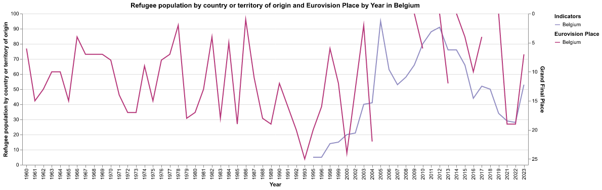
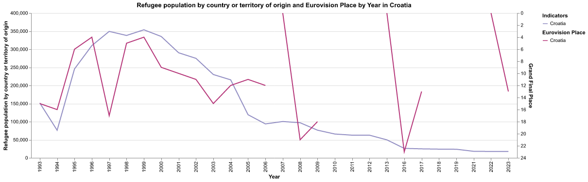
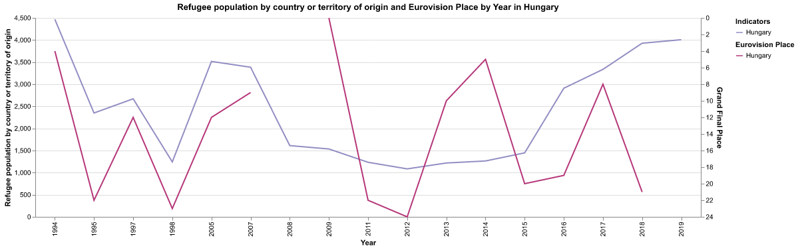
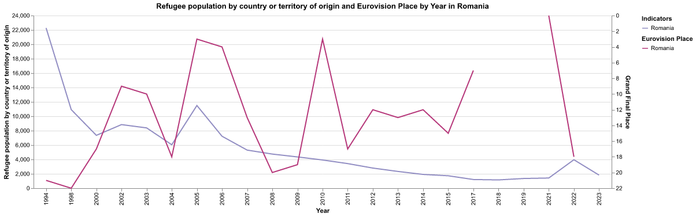

# Eurovision Song Contest Data Exploration

## Eurovision Language Data

## World Bank Data

### Refugees and Eurovision Final Place

Some countries showed some weak correlation between their success in Eurovision versus the refugee population:

> Austria
> 

> Belgium
> 

> Croatia
> 

> Hungary
> 

Others, not so much:

> Romania
> 

> Bosnia and Herzegovina
> 
